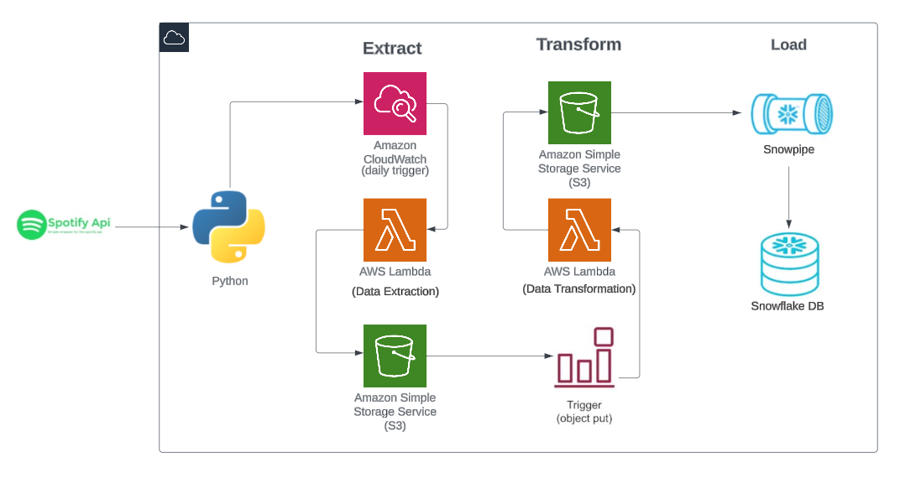

# Spotify Data pipeline (ETL)

**Tech Stack:** Python, AWS (Lambda, Cloud watch, S3, Trigger, Crawler, Glue, Athena)

•	Developed an ETL pipeline for Spotify's data handling, empowering music insights and enhancing accessibility to trends.

•	Used AWS Lambda functions to automate data extraction from Spotify API, reducing manual data handling by 35% and showcasing data profiling skills.

•	Optimized data transformation with S3 triggers and AWS Lambda, leading to the improvement in data sorting, optimization, and retrieval, thus enhancing data accessibility.

•	Automated data identification and retrieval processes from S3 to Athena using Glue Data Catalog with crawlers, and from S3 to Snowflake DB using Snowpipe.

